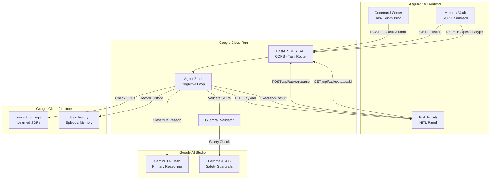
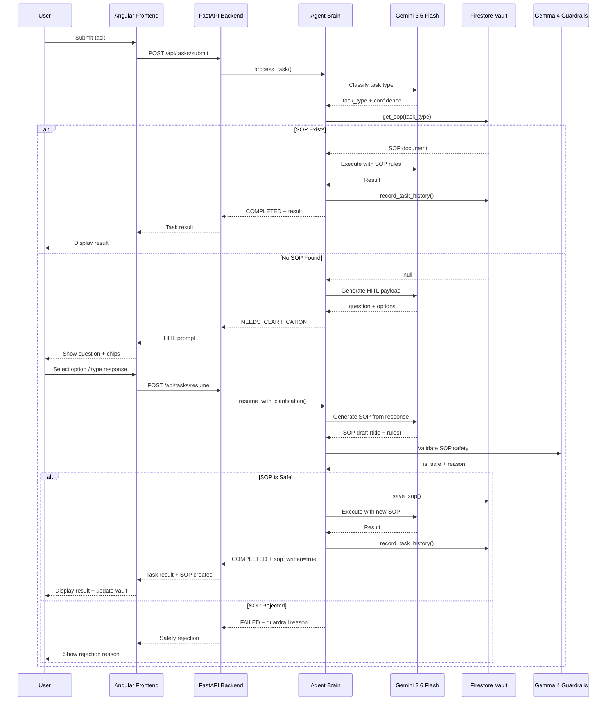

# AgentOS Architecture

> **Track 2 — The Collaborative Partner** | All Things Agentic Hackathon (Google Cloud)

## Overview

AgentOS is a self-documenting, generalist autonomous agent with a **3-tier memory vault** that learns and evolves from human interaction. When given an unfamiliar task, it doesn't fail — it **pauses, asks for guidance, learns the procedure, validates it for safety, and remembers it forever**.

## System Architecture

## Core Flow: The Learning Loop

## 3-Tier Memory Vault

| Tier | Type | Storage | Purpose |
|------|------|---------|---------|
| **Tier 1** | Semantic | Gemini Context | Task classification and understanding |
| **Tier 2** | Procedural | Firestore `procedural_sops` | Learned SOPs — the agent's "playbook" |
| **Tier 3** | Episodic | Firestore `task_history` | Historical record of every execution |

## Multi-Model Architecture

| Model | Role | Why |
|-------|------|-----|
| **Gemini 3.6 Flash** | Primary Brain | 1M token context, fast reasoning, task classification, SOP generation, and task execution |
| **Gemma 4 (26B-a4b-it)** | Guardrail Validator | Lightweight MoE model (4B active params) for safety checking — inspects SOPs for prompt injection, unsafe instructions, and PII leakage before persistence |

## Technology Stack

- **Frontend:** Angular 18 (Standalone components, TypeScript, SCSS)
- **Backend:** Python + FastAPI + Uvicorn
- **AI Models:** Gemini 3.6 Flash + Gemma 4 via `google-genai` Interactions API
- **Database:** Google Cloud Firestore (Native mode)
- **Deployment:** Google Cloud Run + Artifact Registry
- **SDK:** `google-genai` v2.3.0+

## API Endpoints

| Method | Path | Description |
|--------|------|-------------|
| `POST` | `/api/tasks/submit` | Submit a new task |
| `POST` | `/api/tasks/resume` | Submit HITL clarification |
| `GET` | `/api/tasks/status/{id}` | Poll task status |
| `GET` | `/api/sops` | List all learned SOPs |
| `DELETE` | `/api/sops/{type}` | Delete an SOP |

## Track 2 Alignment: The Collaborative Partner

AgentOS embodies Track 2 by:
1. **Collaborative Learning:** The agent actively learns from human guidance through structured HITL dialogues.
2. **Trust Through Transparency:** Every SOP is visible, editable, and deletable in the Memory Vault dashboard.
3. **Safety-First:** Gemma 4 guardrails validate every learned procedure before it's stored.
4. **Growing Autonomy:** Each HITL interaction makes the agent more capable — it never asks the same question twice.
