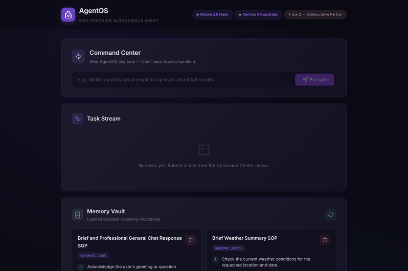

# 🧠 AgentOS — The Self-Teaching Autonomous Agent

> **All Things Agentic Hackathon (Google Cloud)** — Track 2: The Collaborative Partner

AgentOS is a self-documenting, generalist autonomous agent that **learns how to do things from you, remembers forever, and gets smarter with every interaction**.

When you give it a task it hasn't seen before, it doesn't guess — it **pauses, asks you how you'd like it done, learns the procedure, validates it for safety, and stores it as a reusable Standard Operating Procedure (SOP)**. Next time? It handles it autonomously.

---

## 🎬 Live Demo



*Full HD video recording available at [`agent-os-demo.mp4`](agent-os-demo.mp4).*

---

## ✨ Key Features

- **🎯 Zero-Shot Task Handling:** Submit any task — from drafting emails to planning events.
- **🔄 Human-In-The-Loop Learning:** When the agent doesn't know what to do, it asks you — with smart suggestions.
- **📝 Self-Writing SOPs:** Converts your guidance into structured, reusable procedures stored in Firestore.
- **🛡️ Gemma 4 Guardrails:** Every SOP is safety-checked for prompt injection, PII leakage, and unsafe instructions before storage.
- **🧠 3-Tier Memory Vault:** Semantic (understanding) + Procedural (SOPs) + Episodic (history) memory.
- **📊 Memory Vault Dashboard:** See, manage, and delete every SOP the agent has learned.

---

## 🏗️ Tech Stack

| Layer | Technology |
|-------|-----------|
| Frontend | Angular 18 (Standalone, TypeScript, SCSS) |
| Backend | Python 3.11 + FastAPI + Uvicorn |
| Primary AI | Gemini 3.6 Flash (google-genai SDK) |
| Safety AI | Gemma 4 26B-a4b-it (Guardrails) |
| Database | Google Cloud Firestore |
| Deployment | Google Cloud Run + Artifact Registry |

---

## 🚀 Quick Start (Local Development)

### Prerequisites

- Node.js 18+ and npm
- Python 3.9+
- A [Gemini API Key](https://aistudio.google.com/app/api-keys)
- A GCP Project with Firestore enabled
- `gcloud` CLI authenticated (`gcloud auth application-default login`)

### 1. Backend Setup

```bash
cd agent-os/backend

# Create virtual environment
python3 -m venv venv
source venv/bin/activate

# Install dependencies
pip install -r requirements.txt

# Configure environment
cp .env.example .env
# Edit .env with your GEMINI_API_KEY and GCP_PROJECT_ID

# Start the backend
uvicorn app.main:app --reload --port 8080
```

The API will be available at `http://localhost:8080`. Visit `http://localhost:8080/docs` for the interactive Swagger UI.

### 2. Frontend Setup

```bash
cd agent-os/frontend

# Install dependencies
npm install

# Start the dev server (proxies /api to backend)
npx ng serve --proxy-config proxy.conf.json
```

The app will be available at `http://localhost:4200`.

---

## 🧪 Testing Guide for Judges

### Phase 1: The "Teach Phase" (HITL Clarification)

1. Open `http://localhost:4200`
2. In the **Command Center**, type: `"Write a professional email to my team about the quarterly results"`
3. Observe: The agent classifies this as `email_drafting` and **pauses** — it doesn't have an SOP yet.
4. You'll see a **HITL prompt** with a question and suggested option chips.
5. Click a suggested option or type your own guidance (e.g., "Use a formal tone, include a greeting and sign-off, keep it under 200 words").
6. Click **Confirm**.
7. Watch the agent:
   - Generate an SOP from your guidance
   - Validate it through Gemma 4 guardrails
   - Save it to Firestore
   - Execute the task using the new SOP
8. Check the **Memory Vault** panel — you'll see the new SOP listed!

### Phase 2: The "Autonomous Execution Phase" (SOP Recall)

1. Submit a similar task: `"Write an email to my manager about project milestones"`
2. This time, the agent **finds the `email_drafting` SOP** in its memory vault.
3. It executes **immediately and autonomously** — no HITL needed.
4. The agent has learned! 🎉

### Phase 3: Human Oversight

1. In the **Memory Vault** dashboard, review the stored SOPs.
2. Click the **Delete** button on any SOP to remove it.
3. Submit the same task type again — the agent will revert to HITL mode, asking for guidance.
4. This demonstrates full human control over the agent's learned behaviors.

---

## 📁 Project Structure

```
agent-os/
├── backend/
│   ├── app/
│   │   ├── main.py          # FastAPI endpoints
│   │   ├── agent.py          # Gemini brain — reasoning loop
│   │   ├── memory.py         # Firestore Memory Vault
│   │   └── guardrails.py     # Gemma 4 safety validator
│   ├── requirements.txt
│   ├── Dockerfile
│   └── .env.example
├── frontend/                  # Angular 18 app
├── SUBMISSION_EXTRAS/
│   ├── BLOG_POST.md
│   └── SOCIAL_POSTS.md
├── deploy.sh                  # Cloud Run deployment
├── ARCHITECTURE.md            # Technical architecture
└── README.md                  # This file
```

---

## ☁️ Cloud Deployment

```bash
# Set your project
export GCP_PROJECT_ID=your-project-id

# Run the deployment script
chmod +x deploy.sh
./deploy.sh
```

See [deploy.sh](deploy.sh) for the full deployment flow.

---

## 📐 Architecture

See [ARCHITECTURE.md](ARCHITECTURE.md) for the full technical architecture, Mermaid diagrams, and design decisions.

---

## 📝 License

Built for the All Things Agentic Hackathon. MIT License.
